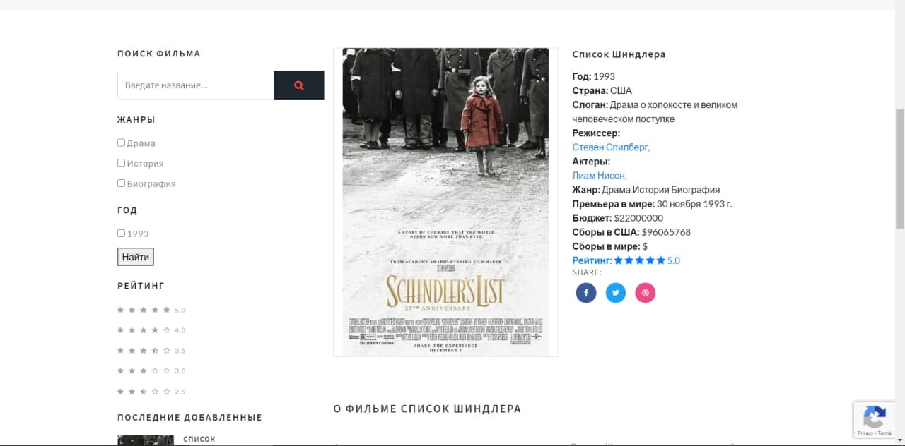

Возможности сайта Kinomania

```
> Поиск фильмов
> Фильтрация по жанрам и по годам
> Регистрация и авторизация пользователя
> Пагинация списка фильмов
> Оставить отзовы к фильмам
> Детаяльная описания фильма
> Языки сайта: Русский и Английский
```
# Kinomania на Django 3
> Шаблон дизайна не я создавал, а лишь интегрировал с Django 3.


Сайт является учебным проектом. Проект не полноценный и в ходе изучения Django 3, дополняю сайт.

## Можели для базы данных

- [x] Movie
- [x] Actors
- [x] Category
- [x] Genre
- [x] MovieShots
- [x] RaringStar
- [x] Rating
- [x] Reviews


## Важно!

Для работы проекта требуется установить с помощью pip 
install следующие приложения из файле :

- asgiref==3.2.3
- certifi==2019.11.28
- chardet==3.0.4
- Click==7.0
- defusedxml==0.6.0
- Django==3.0.3
- django-allauth==0.41.0
- django-ckeditor==5.9.0
- django-js-asset==1.2.2
- django-modeltranslation==0.14.4
- django-recaptcha3==0.1.0
- h11==0.9.0
- httptools==0.0.13
- idna==2.9
- oauthlib==3.1.0
- Pillow==7.0.0
- python3-openid==3.1.0
- pytz==2019.3
- requests==2.23.0
- requests-oauthlib==1.3.0
- six==1.14.0
- sqlparse==0.3.0
- urllib3==1.25.8

> Дополнительно нужно создать папку media в корне проекта.


## Screens


 
 
 
 
 


### Скриншоты из администрирование сайта
 
 
 